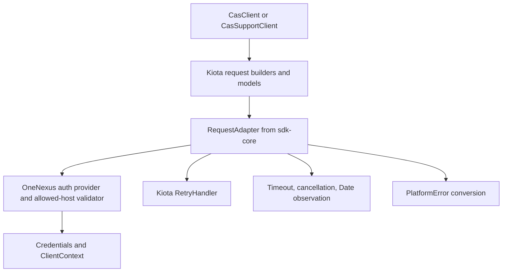

# `ts/` — TypeScript SDKs

pnpm workspace containing the TypeScript client SDKs for the OneNexus platform.
The language-agnostic credential model is documented in [`../README.md`](../README.md).

## Packages

| Package                             | Responsibility                                                                                                                                                                                                          |
| ----------------------------------- | ----------------------------------------------------------------------------------------------------------------------------------------------------------------------------------------------------------------------- |
| `@onenexus-team/sdk-core`           | OneNexus credentials, `ClientContext`, skew-aware clock, Kiota authentication bridge, request-adapter construction, native retry middleware, timeout/cancellation, Date-header observation, and shared RFC 9457 errors. |
| `@onenexus-team/sdk-core/node`      | Node-only credential helpers, including `WorkloadIdentityFileCredentials`.                                                                                                                                              |
| `@onenexus-team/cas-client`         | Kiota-generated CAS customer API/models plus the flat `CasClient` facade.                                                                                                                                               |
| `@onenexus-team/cas-support-client` | Kiota-generated CAS support API/models plus the flat `CasSupportClient` facade.                                                                                                                                         |

The generated clients use repository-pinned Kiota CLI `1.34.1`. All coordinated
Kiota TypeScript runtime packages are pinned exactly to
`1.0.0-preview.103`.

## Prerequisites

- Node.js `>24.17.0`
- pnpm `>=11.7.0` (`pnpm@11.14.0` is pinned in `package.json`)
- The repository Kiota executable at `../.tools/kiota/kiota`

## Commands

Run commands from `ts/`:

```sh
pnpm install
pnpm -r run typecheck
pnpm -r run lint
pnpm -r run build
pnpm -r run test
pnpm package
```

`pnpm package` synchronizes package versions, regenerates both service clients,
builds and tests all packages, and writes tarballs under `.local-packages/`.
It does not publish packages.

## Architecture



A facade instance owns one isolated adapter and one client context:

1. The flat facade method calls the matching generated Kiota request builder.
2. `sdk-core` resolves the configured `Credentials` and adds the bearer token
   only when the target URL matches the configured `baseUrl` host.
3. The request runs through Kiota's fetch client and native middleware chain.
4. Every response attempt with a valid `Date` header updates the context clock.
5. Final JSON Problem Details responses become shared `PlatformError`
   subclasses, retaining OneNexus extensions such as `code`, `requestId`, and
   validation `errors`.
6. The generated Kiota model parser handles successful responses. Facades
   normalize Kiota `UntypedNode` values back to ordinary JSON scalars/objects.

The generated fluent clients are implementation details. Package roots continue
to expose the flat `CasClient` and `CasSupportClient` methods and generated model
types.

## Client construction

```ts
import { CasClient } from '@onenexus-team/cas-client';
import { TokenGrantCredentials } from '@onenexus-team/sdk-core';

const cas = new CasClient({
    baseUrl: 'https://cas.acme.com',
    credentials: new TokenGrantCredentials({
        token: {
            accessToken: '...',
            tokenType: 'Bearer',
            expiresAt: new Date(Date.now() + 60 * 60 * 1000),
        },
    }),
    timeout: 30_000,
    retry: { limit: 2 },
});

const result = await cas.createUser({
    email: 'a@b.c',
    displayName: 'A B',
    requestId: 'request-1',
});
```

Every facade method accepts an optional `{ signal: AbortSignal }` second
argument. Raw request-adapter or fetch configuration is not exposed through the
service facades.

### Retry behavior

Retries use Kiota's unmodified `RetryHandler`:

- retryable statuses: `429`, `503`, and `504`;
- buffered POST, PUT, and PATCH bodies are retryable;
- default retry limit: `2` retries after the initial attempt;
- default initial delay: `300 ms`, with Kiota's native jitter and exponential
  backoff;
- Kiota's native maximum retry delay is fixed at `180 seconds`.

`retry.limit` maps to Kiota's `maxRetries`. The legacy
`retry.backoffLimitMs` field remains accepted for source compatibility, but
Kiota does not expose a configurable maximum delay; it only caps the initial
`300 ms` delay used to construct `RetryHandlerOptions`.

Native retries reuse the serialized body and request headers, including the
resolved authorization header. Credential resolution therefore occurs once per
facade operation, not once per retry attempt. A plain `401` is not retried by
`RetryHandler`.

### Timeout and cancellation

`timeout` is a per-attempt fetch timeout and defaults to `30_000 ms`. Set it to
`0` to disable the SDK timeout. A caller signal and the timeout signal are
combined, and the caller signal is also supplied to credential resolution.

## Client generation

Generated code is committed under each service package's `src/generated/`.
Regenerate from `ts/` with:

```sh
pnpm --filter @onenexus-team/cas-client run generate
pnpm --filter @onenexus-team/cas-support-client run generate
```

The package scripts invoke `../.tools/kiota/kiota` with:

- `--language TypeScript`
- `--clean-output`
- `--exclude-backward-compatible`
- `--additional-data false`
- structured MIME types `application/json` and `application/problem+json`
- class/namespace pairs `CasApiClient` / `OneNexus.Cas` and
  `CasSupportApiClient` / `OneNexus.CasSupport`

The exact commands are intentionally stored in each service package's
`package.json`; there are no legacy generator configuration or service transport files.

Each service package directly declares every Kiota dependency imported by its
generated source:

- `@microsoft/kiota-abstractions`
- `@microsoft/kiota-serialization-form`
- `@microsoft/kiota-serialization-json`
- `@microsoft/kiota-serialization-multipart`
- `@microsoft/kiota-serialization-text`

`@onenexus-team/sdk-core` directly declares
`@microsoft/kiota-abstractions` and
`@microsoft/kiota-http-fetchlibrary`.

## Adding another service client

1. Add `packages/<service>-client` to the existing pnpm workspace.
2. Add an exact Kiota generation command to its `generate` script, targeting
   `src/generated` and the committed OpenAPI document.
3. Declare direct runtime dependencies used by generated imports and a
   workspace dependency on `@onenexus-team/sdk-core`.
4. Construct the generated client with `this.requestAdapter` from `ClientBase`.
5. Keep generated request builders private and expose a small flat facade.
6. Re-export generated model types from the package root.
7. Add facade routing/authentication tests for every new public method.
8. Run generation, typecheck, lint, build, and tests before packaging.

## Kiota TypeScript caveats

Kiota's TypeScript target and runtime packages are currently preview software.
For CLI `1.34.1` / runtime `1.0.0-preview.103`:

- generated deserializers are incompatible with
  `exactOptionalPropertyTypes: true`; this option is disabled only in the two
  service-package tsconfigs, while `sdk-core` remains strict;
- OpenAPI union values such as `integer|string` become `UntypedNode`; facade
  request/response normalization preserves ordinary JSON numeric values;
- UUID-formatted values are validated while deserializing, so invalid UUID test
  fixtures deserialize as `undefined`;
- date-time values deserialize to JavaScript `Date` objects;
- free-form object schemas generated with `--additional-data false` cannot
  retain unknown response members. Facade requests preserve their original JSON
  body, but a free-form response object may still deserialize as an empty model
  until the upstream schema is made explicit or Kiota improves this case;
- the committed specs have no `servers` entry, so `sdk-core` sets the adapter
  `baseUrl` from each facade configuration.

## Release consumption

Consumers install the published package artifacts and version pins; they must
not import source paths from this repository.

```sh
pnpm add @onenexus-team/sdk-core@<version> @onenexus-team/cas-client@<version>
```

GitHub Packages consumers need the `@onenexus-team` registry mapping and a token
with package read access.
