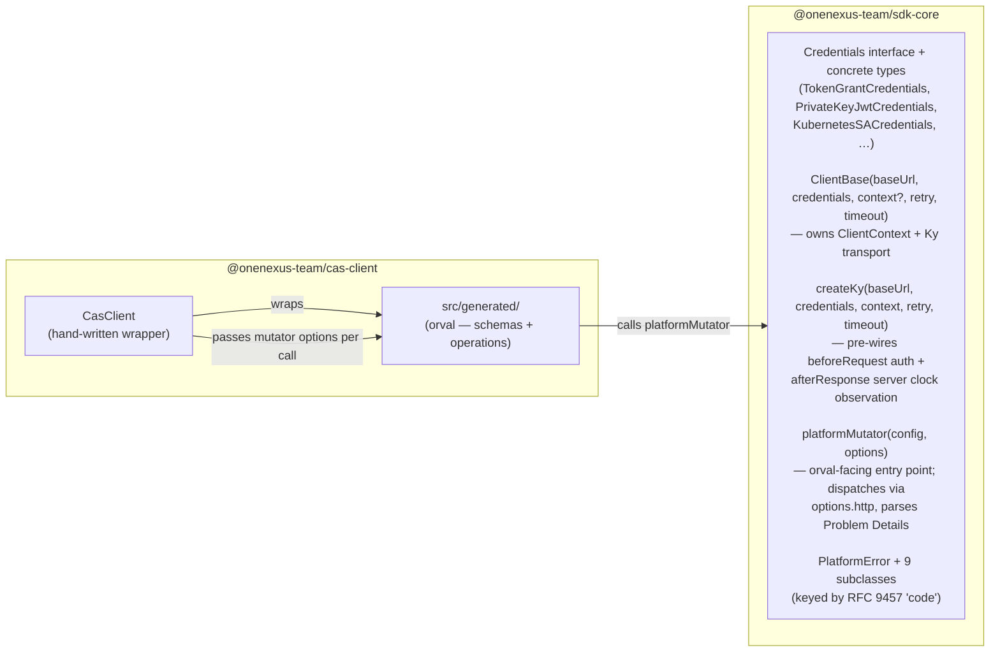

# `ts/` — TypeScript SDKs

pnpm workspace containing the TypeScript client SDKs for the OneNexus platform.

The credential object system that underpins every client is documented in
[`../README.md`](../README.md). Server-side concerns (token validation, codegen
internals, per-service SDK shape) are out of scope for this workspace.

## Packages

| Package                   | Description                                                                                                               |
| ------------------------- | ------------------------------------------------------------------------------------------------------------------------- |
| `@onenexus-team/sdk-core`      | Credential primitives (`AccessToken`, `Credentials`, `ClientContext`), `ClientBase`, Ky-based HTTP transport, custom mutator factory, RFC 9457 error mapping. |
| `@onenexus-team/sdk-core/node` | Node-only subpath. Exports `WorkloadIdentityFileCredentials` (reads a runtime-mounted token file off disk).         |
| `@onenexus-team/cas-client`    | Generated client for the Central Auth Service, built from `specs/cas/openapi.json` via `orval@8.10.0`.            |
| `@onenexus-team/cas-support-client` | Generated client for the Central Auth Service support API, built from `specs/cas-support/openapi.json` via `orval@8.10.0`. |

## Prerequisites

- Node.js > 24.17
- pnpm ≥ 11.7 (pinned via `packageManager` in `package.json`)

## Commands

Run from `ts/`:

```sh
pnpm install              # install workspace dependencies
pnpm package              # generate clients, build packages, run tests, then pack tarballs to .local-packages/
```

Private-key JWT + CAS AssumeS3Role + S3 smoke test:

```sh
pnpm install
ONENEXUS_PRIVATE_JWK_PATH=/secure/path/client-private-jwk.json \
ONENEXUS_CAS_ISSUER=https://cas.onenexus.local \
ONENEXUS_CAS_API_BASE_URL=https://cas.onenexus.local \
ONENEXUS_CLIENT_ID=<client-id> \
ONENEXUS_S3_ROLE_NAME=<role-name> \
ONENEXUS_S3_ENDPOINT_URL=<s3-endpoint> \
ONENEXUS_INSECURE_SKIP_TLS_VERIFY=true \
pnpm exec tsx examples/private-key-jwt-assume-s3-role.ts
```

Use `ONENEXUS_DEBUG_CLIENT_ASSERTION=true` to print the non-secret assertion
header/claims while debugging CAS `invalid_client` responses.

`pnpm package` is the single pre-release/local-consumption command. It regenerates
all service clients from the committed OpenAPI specs, builds every package, runs
the package tests, synchronizes package versions from `../VERSION`, and writes
local tarballs under `ts/.local-packages/`.

## Release packages

Local TypeScript package versions are synchronized from the repository-level
`../VERSION` file before packaging. Publishing a GitHub release with a tag such
as `v0.0.6` triggers the SDK release workflow, which derives `0.0.6` from the tag
and uses it as every package version. The TypeScript job runs in parallel with
the Python job, caches pnpm package restores, builds and tests the workspace,
attaches the `.tgz` tarballs to the triggering release, and publishes the
packages to GitHub Packages' npm registry.

Consumers using GitHub Packages need an npm token that can read packages and a
scope mapping for the OneNexus packages:

```sh
@onenexus-team:registry=https://npm.pkg.github.com
//npm.pkg.github.com/:_authToken=${GITHUB_TOKEN_OR_PAT}
```

Then install package versions normally:

```sh
pnpm add @onenexus-team/sdk-core@0.0.1 @onenexus-team/cas-client@0.0.1
```

The generated release also contains tarballs that can be installed directly from
the GitHub release assets when registry consumption is not desired.

## Architecture

Three layers, separated by package boundary:



**Call flow for a single CAS RPC** (e.g. `cas.createTenant(req)`):

1. `CasClient.createTenant` calls the orval-generated `createTenant` with
    mutator options supplied by `ClientBase` as the second argument.
2. The generated function constructs the `{ url, method, headers, data }`
   config and calls `platformMutator`.
3. `platformMutator` dispatches the request through the supplied Ky instance.
4. Ky's `beforeRequest` hook resolves the credential with the client's
    `ClientContext` and stamps `Authorization: Bearer <token>` onto the request.
5. On success, `platformMutator` parses JSON and returns it. On 4xx/5xx with a
   Problem Details body, it throws the matching `PlatformError` subclass.
6. Ky's `afterResponse` hook records the server `Date` header in the client's
    clock, so subsequent credential expiry checks use server time. Credential
    auth failures (`StaleCredentialsError`, `AuthenticationError`) fail fast.
7. Retryable responses use the SDK retry policy: default limit 2, retryable RPC
    methods including POST, exponential backoff with full jitter, and a default
    per-retry delay cap of 5 seconds. Client constructors expose `retry.limit`,
    `retry.backoffLimitMs`, and `refreshLeewayMs`.

## Adding a new service client

Follow this recipe for a new service (using `mlops-client` as the example).

### 1. Spec lives outside this workspace

The OpenAPI spec must already exist at `specs/<service>/openapi.json`.
It is not generated here.

### 2. Create the package directory

Copy `packages/cas-client/` to `packages/<service>-client/` (or scaffold from
scratch). Each service-client package contains:

```
packages/<service>-client/
├── package.json
├── orval.config.ts
├── tsconfig.json
├── tsup.config.ts
├── vitest.config.ts
├── src/
│   ├── index.ts       # exports the client class + schema types
│   ├── client.ts      # hand-written wrapper class
│   ├── mutator.ts     # local re-export of platformMutator (see step 4)
│   └── generated/     # orval output — committed
└── test/
```

### 3. Update `package.json`

```jsonc
{
    "name": "@onenexus-team/<service>-client",
    "version": "0.0.0",
    "private": true,
    "type": "module",
    "exports": {
        ".": {
            "development": "./src/index.ts", // ← reads source during tsc/vitest
            "types": "./dist/index.d.ts",
            "import": "./dist/index.js",
        },
    },
    "files": ["dist"],
    "scripts": {
        "build": "tsup",
        "typecheck": "tsc --noEmit",
        "lint": "eslint .",
        "test": "vitest run",
        "generate": "orval --config ./orval.config.ts",
    },
    "dependencies": {
        "@onenexus-team/sdk-core": "workspace:^",
    },
}
```

The `development` condition is what lets sibling workspace packages and
tsc/vitest read sources without a build step — paired with
`customConditions: ["development"]` in `tsconfig.base.json` and an explicit
`resolve.conditions` in `vitest.config.ts` (step 6 below).

### 4. Write `src/mutator.ts` as a wrapper _function_

Orval's `mutator.path` parser only recognises locally-declared `function` exports.
A bare `export { x } from '@onenexus-team/sdk-core'` or a `const` alias is silently
dropped, producing the misleading error
`Your mutator file doesn't have the platformMutator exported function`.

The minimum working wrapper:

```ts
import {
    platformMutator as _platformMutator,
    type PlatformMutatorOptions,
    type PlatformMutatorRequestConfig,
} from '@onenexus-team/sdk-core';

export async function platformMutator<T>(
    config: PlatformMutatorRequestConfig,
    options?: PlatformMutatorOptions,
): Promise<T> {
    return _platformMutator<T>(config, options);
}
```

Pure pass-through; the real implementation stays in `@onenexus-team/sdk-core`.

### 5. Configure orval

```ts
// orval.config.ts
import { defineConfig } from 'orval';

export default defineConfig({
    <service>: {
        input: { target: '../../../specs/<service>/<version>/openapi.json' },
        output: {
            mode: 'tags-split',                              // one file per OpenAPI tag
            target: './src/generated/<service>.ts',
            schemas: './src/generated/schemas',
            client: 'axios',                                 // ← see note below
            baseUrl: '',                                     // runtime baseUrl via Ky's prefixUrl
            override: {
                mutator: { path: './src/mutator.ts', name: 'platformMutator' },
            },
        },
    },
});
```

**`client: 'axios'` is correct** — this is _not_ an axios runtime dependency.
The "axios" name only describes the shape of the config object orval passes to
our mutator (`{ url, method, headers, params, data, signal }`). `client: 'fetch'`
was tried first; its generator passes `(url: string, init: RequestInit)` with no
slot for the per-call `{ http }` mutator options we need to thread through.

### 6. Configure tsup, tsconfig, vitest

**`tsup.config.ts`** — externalize `@onenexus-team/sdk-core` so it isn't bundled
into the service-client's dist:

```ts
import { defineConfig } from 'tsup';

export default defineConfig({
    entry: { index: 'src/index.ts' },
    outDir: 'dist',
    format: ['esm'],
    target: 'es2022',
    dts: true,
    clean: true,
    sourcemap: true,
    treeshake: true,
    splitting: false,
    external: ['@onenexus-team/sdk-core'],
});
```

**`tsconfig.json`** — extends the base and includes config files so ESLint sees them:

```jsonc
{
    "extends": "../../tsconfig.base.json",
    "include": ["src/**/*", "test/**/*", "tsup.config.ts", "vitest.config.ts", "orval.config.ts"],
}
```

**`vitest.config.ts`** — explicit `resolve.conditions` so vitest (Vite under
the hood) honours the `development` export condition the same way tsc does:

```ts
import { defineConfig } from 'vitest/config';

export default defineConfig({
    resolve: {
        conditions: ['development', 'import', 'module', 'node', 'default'],
    },
    test: {
        include: ['test/**/*.test.ts'],
        environment: 'node',
        coverage: {
            provider: 'v8',
            include: ['src/**/*.ts'],
            exclude: ['src/generated/**', 'src/**/index.ts', 'src/mutator.ts'],
            reporter: ['text', 'html'],
        },
    },
});
```

Without this, vitest tries to resolve `@onenexus-team/sdk-core` to `dist/index.js`,
which may not exist or be stale. With it, vitest reads from source.

### 7. Run codegen

```sh
pnpm install                                   # picks up the new package
pnpm --filter @onenexus-team/<service>-client run generate
```

The generated files land under `src/generated/`. **Commit them.** The root-level
`pnpm package` command regenerates every service client before build/test/package,
so spec drift shows up as a generated-code diff.

### 8. Write `src/client.ts` and `src/index.ts`

Hand-written client class binding the generated operations. See
`packages/cas-client/src/client.ts` for the template. The shape:

```ts
import { ClientBase, type ClientBaseConfig, type PlatformMutatorOptions } from '@onenexus-team/sdk-core';
import { getXxx } from './generated/xxx/xxx.js';
import type { /* schema types */ } from './generated/schemas/index.js';

export interface <Service>ClientConfig extends ClientBaseConfig {}

export type <Service>RequestOptions = Omit<PlatformMutatorOptions, 'http'>;

export class <Service>Client extends ClientBase {
    private readonly xxx: ReturnType<typeof getXxx>;

    constructor(config: <Service>ClientConfig) {
        super(config);
        this.xxx = getXxx();
    }

    // One line per operation. The generated function name comes from the
    // operationId emitted by the service OpenAPI spec.
    createSomething = (req: SomethingRequest, options?: <Service>RequestOptions) =>
        this.xxx.createSomething(req, this.mutatorOptions(options));
}
```

`ClientBaseConfig` includes:

- `baseUrl`
- `credentials`
- `context?` for sharing a `ClientContext`
- `refreshLeewayMs?` for client-level preemptive credential refresh
- `timeout?`
- `retry.limit?`
- `retry.backoffLimitMs?`
- `extraOptions?` for advanced Ky options

`src/index.ts` re-exports the class and schema types:

```ts
export { <Service>Client, type <Service>ClientConfig, type <Service>RequestOptions } from './client.js';
export type * from './generated/schemas/index.js';
```

### 9. Verify and package

```sh
pnpm install
pnpm package
```

The root `pnpm package` command already picks up the new client package via the
`--filter './packages/*-client'` glob during generation, then builds, tests, and
packs all SDK packages.

## Design notes (gotchas worth remembering)

Captured here so the next service client doesn't rediscover them.

**Why a wrapper class around the generated functions?** Orval generates
factory-closure-scoped functions with no per-instance state. `ClientBase`
holds _this consumer's_ credentials, baseUrl, retry policy, and `ClientContext`,
then threads the transport as the second argument to every generated call.
Without the wrapper class, every consumer call site repeats the setup.

**What retry policy do clients use?** The SDK uses Ky retries with RPC-friendly
methods (including POST), retryable statuses `401`, `408`, `429`, and `5xx`,
default limit `2`, and exponential backoff with full jitter. The default base
delay is 300 ms and the per-retry delay is capped at 5 seconds. Set
`retry.limit` and `retry.backoffLimitMs` on the service-client constructor to
tune this.

**Why `client: 'axios'` even though we don't use axios?** The label describes
the shape of the config object orval passes to the mutator (`{ url, method,
headers, params, data, signal }`), which gives us the second-argument slot we
need for `{ http }`. `client: 'fetch'` passes
`(url: string, init: RequestInit)` directly — no slot for per-call instance
state. Verified by the generated `import` in
`packages/cas-client/src/generated/tenant/tenant.ts`: nothing imports from
`'axios'`.

**Why a `function` wrapper for the mutator, not a re-export?** Orval's
`mutator.path` parser only recognises locally-declared `function` exports. A
bare `export { x } from 'pkg'` or `const` alias produces a misleading
"doesn't have the … exported function" error.

**Why the `"development"` export condition?** Lets `tsc`, `tsup`, and `vitest`
read `@onenexus-team/sdk-core` (and future workspace packages) directly from source
during development. No build-before-typecheck dance, no stale `dist/`. Set in
three places:

- `tsconfig.base.json` → `customConditions: ["development"]`
- Each package's `package.json` → `"development"` key first in `exports`
- Each service-client's `vitest.config.ts` → `resolve.conditions: ['development', ...]`

External consumers (after `pnpm pack` / publish) don't have `customConditions`
set, so they fall through to `types` + `import` and get the built `dist/` —
correct behaviour.

**Why `external: ['@onenexus-team/sdk-core']` in tsup?** Don't bundle the workspace
peer into the service-client's `dist`. Consumers install both packages
separately; auth and HTTP code lives in exactly one place at runtime.

**Why is `WorkloadIdentityFileCredentials` on a `/node` subpath?** It's the
only credential that reads from `node:fs/promises` (the runtime-mounted identity
token file). Putting it behind `@onenexus-team/sdk-core/node` means SPA bundles
can't accidentally include it; every other credential works in both runtimes
via Web Crypto.

## Status

- `@onenexus-team/sdk-core` owns the credential primitives, `ClientBase`, Ky
    transport, mutator, and Problem Details error mapping.
- `@onenexus-team/cas-client` and `@onenexus-team/cas-support-client` extend `ClientBase`
    and bind generated operations to the shared mutator.
- Token exchange is not currently exported as an SDK credential type.
